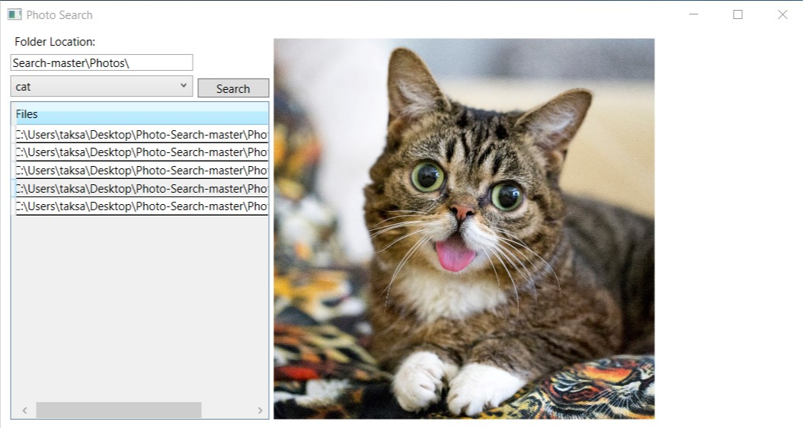

# Photo-Search

This is an example project is to show how to build a Keras model, export the model to ONNX format, and be used to make prediction by ML.net.

## Requirements
For the Modeling part you need Keras.  To export the model from Keras to ONNX, you need WinMLTools.

For the Inference part you need .NET Core3 SDK preview and .net core 3 runtime.  

The .Net Core 3 SDK and .Net Core 3 runtime can be download via: https://dotnet.microsoft.com/download/dotnet-core/3.0

You need to enable VS to allow for .NET Core3 SDK preview to be used.  

See link: https://blogs.msdn.microsoft.com/dotnet/2018/11/13/net-core-tooling-update-for-visual-studio-2017-version-15-9/

## Usage
When you get to the main screen.  Make sure to change the path to the path of the photos.  Currently, it is set to "C:\ML\Photos\"

Select "All" then click on search.  This should output all the photos in the folder.  

Select "Cat" or "Dog" then click on search.  This should output only the photos in the folder that has such classification.
